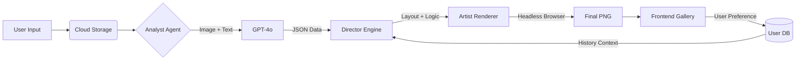

# Kaleido

---

## Adaptive AI Poster & Carousel Generator

A programmatic design engine that transforms a single photo and short intent into export-ready social media assets. Instead of manually manipulating layers as in Canva, the system behaves like an autonomous designer—parsing the vibe, selecting layouts, and delivering polished posters or Instagram carousels tailored to each user.

---

### 🧠 Core Concept
- **Input**: User uploads an image plus a short intent such as “We won the finals.”
- **Analysis**: AI extracts palettes, detects objects/moods, and drafts copy.
- **Mapping**: A CSS-driven layout blueprint is selected programmatically.
- **Rendering**: A headless browser converts the layout into high-res PNGs.
- **Learning**: User selections feed a preference model that adapts future outputs.

---

### 🏗️ System Architecture
The pipeline flows linearly from ingestion to adaptive learning.



---

### 🛠️ Tech Stack
| Component | Technology | Role |
| --- | --- | --- |
| Frontend | Next.js (React) | Upload UI, previews |
| Backend | Python (FastAPI) | Orchestrates AI/rendering |
| AI Model | OpenAI GPT-4o | Vision + copywriting |
| Rendering | Puppeteer / Playwright | “Artist” screenshot service |
| Database | Supabase (PostgreSQL) | User style profiles, asset history |
| Storage | AWS S3 or Cloudinary | Hosts uploads and outputs |

---

### ⚡ Feature Highlights
- **Context Awareness**: Classifies vibe (Celebration, Sale, Casual).
- **Smart Color Extraction**: Dominant hex palette drives theming.
- **Dynamic Layouts**: Chooses poster vs. carousel by content depth.
- **Auto Copywriting**: Generates hooks, body copy, CTAs.
- **Adaptive Learning**: Remembers if a user prefers Neon/Bold vs. Pastel/Minimal.

---

### 🚀 Getting Started
**Prerequisites**
- Node.js v18+
- Python v3.9+
- OpenAI API key
- Supabase/PostgreSQL URL
- Cloudinary/S3 credentials

**Setup**
```bash
git clone https://github.com/yourusername/adaptive-ai-designer.git
cd adaptive-ai-designer
```

Frontend
```bash
cd frontend
npm install
# Create .env.local (see .env.example)
npm run dev
```

Backend
```bash
cd backend
python -m venv venv
source venv/bin/activate  # Windows: venv\Scripts\activate
pip install -r requirements.txt
# Create .env (see .env.example)
uvicorn main:app --reload
```

---

### 📂 Project Structure
```bash
.
├── frontend/             # Next.js application
│   ├── components/       # UI components
│   ├── templates/        # HTML/CSS blueprints
│   └── pages/            # App routes
├── backend/              # FastAPI service
│   ├── app/
│   │   ├── agents/       # Prompt engineering + logic
│   │   ├── renderer/     # Headless browser scripts
│   │   └── models/       # Pydantic schemas
│   └── main.py           # API entry point
└── README.md
```

---

### 📝 Configuration
Create `backend/.env` with:
```
OPENAI_API_KEY=sk-...
DATABASE_URL=postgresql://...
CLOUDINARY_CLOUD_NAME=...
CLOUDINARY_API_KEY=...
CLOUDINARY_API_SECRET=...
```

---

### 🗺️ Roadmap
- [ ] Phase 1: Engine — build 3 static templates, hook up Puppeteer rendering.
- [ ] Phase 2: Brain — integrate GPT-4o analysis and connect UI inputs to pipeline.
- [ ] Phase 3: Intelligence — user DB, feedback loop influencing future prompts.

---

### 🤝 Contributing
1. Fork the project
2. Create a feature branch `git checkout -b feature/AmazingFeature`
3. Commit `git commit -m "Add AmazingFeature"`
4. Push `git push origin feature/AmazingFeature`
5. Open a pull request

---

### 📄 License
Distributed under MIT—see `LICENSE`.

---

### 💡 Acknowledgements
- OpenAI for GPT-4o Vision API
- Vercel for Next.js infrastructure
- Supabase for the database layer

